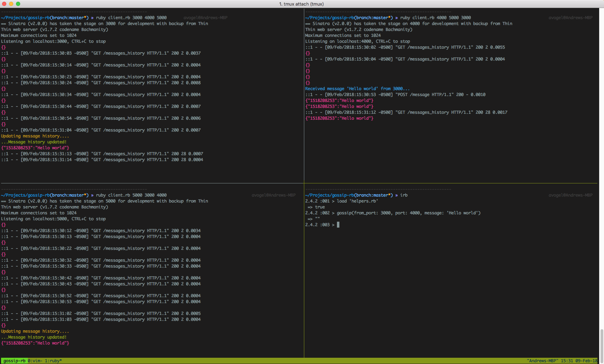

Gossip-rb
===

A simple [gossip protocol](https://en.wikipedia.org/wiki/Gossip_protocol) implemented using Ruby and Sinatra. The the network requests (Faraday) connect to peers to send messages and also receive peer message state.

### Setup

```sh
bundle install
```

### Run the server

The client takes multiple arguments. The first argument is the port for the client to run on and the rest are peer ports for that node.

```sh
ruby client.rb 3000 4000 # one peer port

ruby client.rb 3000 4000 5000 6000 7000 # multiple peer ports
```


##### Andrew Vogel
##### [Gossip Protocol Slides - Miniconf 2018](https://github.com/avogel3/gossip-rb/blob/master/doc/GossipProtocol.pdf)


